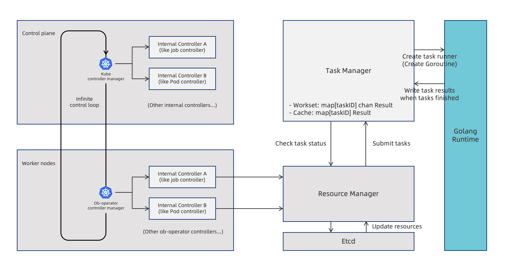

# ob-operator

ob-operator 是满足 Kubernetes Operator 扩展范式的自动化工具，可以极大简化在 Kubernetes 上部署和管理 OceanBase 集群及相关资源的过程。

[English version](./README.md) of this document is available.

## 快速上手

这部分以一个简单示例说明如何使用 ob-operator 快速部署 OceanBase 集群。

### 前提条件

开始之前请准备一套可用的 Kubernetes 集群，并且至少可以分配 2C, 10G 内存以及 100G 存储空间。

ob-operator 依赖 [cert-manager](https://cert-manager.io/docs/), cert-manager 的安装可以参考对应的[安装文档](https://cert-manager.io/docs/installation/)，如果您无法访问官方制品托管在 `quay.io` 镜像站的镜像，可通过下面的指令安装我们转托在 `docker.io` 中的制品：

```shell
kubectl apply -f https://raw.githubusercontent.com/oceanbase/ob-operator/2.1.2_release/deploy/operator.yaml
```

本例子中的 OceanBase 集群存储依赖 [local-path-provisioner](https://github.com/rancher/local-path-provisioner) 提供, 需要提前进行安装并确保其存储目的地有足够大的磁盘空间。

### 部署 ob-operator

#### 使用 YAML 配置文件

通过以下命令即可在 K8s 集群中部署 ob-operator：

* 稳定版本

```shell
kubectl apply -f https://raw.githubusercontent.com/oceanbase/ob-operator/2.1.2_release/deploy/operator.yaml
```

* 开发版本

```shell
kubectl apply -f https://raw.githubusercontent.com/oceanbase/ob-operator/master/deploy/operator.yaml
```

#### 使用 Helm Chart

Helm Chart 将 ob-operator 部署的命名空间进行了参数化，可在安装 ob-operator 之前指定命名空间。

```shell
helm repo add ob-operator https://oceanbase.github.io/ob-operator/
helm install ob-operator ob-operator/ob-operator --namespace=oceanbase-system --create-namespace --version=2.1.2
```

#### 验证部署结果

安装完成之后，可以使用以下命令验证 ob-operator 是否部署成功：

```shell
kubectl get pod -n oceanbase-system

# 预期的输出
NAME                                            READY   STATUS    RESTARTS   AGE
oceanbase-controller-manager-86cfc8f7bf-4hfnj   2/2     Running   0          1m
```

### 部署 OceanBase 集群

创建 OceanBase 集群之前，需要先创建好若干 secret 来存储 OceanBase 中的特定用户的密码：

```shell
kubectl create secret generic root-password --from-literal=password='root_password'
kubectl create secret generic proxyro-password --from-literal=password='proxyro_password'
kubectl create secret generic monitor-password --from-literal=password='monitor_password'
kubectl create secret generic operator-password --from-literal=password='operator_password'
```

通过以下命令即可在 K8s 集群中部署 OceanBase：

```shell
kubectl apply -f https://raw.githubusercontent.com/oceanbase/ob-operator/2.1.2_release/example/quickstart/obcluster.yaml
```

一般初始化集群需要 2 分钟左右的时间，执行以下命令，查询集群状态，当集群状态变成 running 之后表示集群创建和初始化成功：

```shell
kubectl get obclusters.oceanbase.oceanbase.com test

# desired output 
NAME   STATUS    AGE
test   running   6m2s
```

### 连接集群

通过以下命令查找 observer 的 POD IP，POD 名的规则是 {cluster_name}-{cluster_id}-{zone}-uuid：

```shell
kubectl get pods -o wide
```

通过以下命令连接：

```shell
mysql -h{POD_IP} -P2881 -uroot -proot_password oceanbase -A -c
```

## 项目架构

ob-operator 以 kubebuilder 为基础，通过统一的资源管理器接口、全局的任务管理器实例以及解决长调度的任务流机制完成对 OceanBase 集群及相关应用的控制和管理。ob-operator 的架构大致如下图所示：



有关架构细节可参见[架构设计文档](./docs/zh_CN/arch.md)。

## 特性

ob-operator 支持 OceanBase 集群的管理、租户管理、备份恢复、故障恢复等功能，具体而言支持了以下功能：

- [x] 集群管理：集群自举、调整集群拓扑、支持 K8s 拓扑配置、扩缩容、集群升级、修改参数
- [x] 租户管理：创建租户、调整租户拓扑、管理资源单元、修改用户密码
- [x] 备份恢复：向 OSS 或 NFS 目的地周期性备份数据、从 OSS 或 NFS 中恢复数据
- [x] 物理备库：从备份中恢复出备租户、创建空备租户、备租户升主、主备切换
- [x] 故障恢复：单节点故障恢复，IP 保持情况下的集群故障恢复

即将支持的功能有：

- [ ] Dashboard：基于 ob-operator 的图形化 OceanBase 集群管理工具
- [ ] 丰富的运维任务资源：包括但不限于针对集群和租户的轻量任务


## 支持的 OceanBase 版本

支持 OceanBase v4.x 版本，已经验证过的有 4.1.x 和 4.2.x 版本，后续会不断支持 OceanBase 社区版的新版本。

暂不支持 OceanBase v3.x 版本。

## 环境依赖

ob-operator 使用 [kubebuilder](https://book.kubebuilder.io/introduction) 项目进行构建，所以开发和运行环境与其相近。

* 构建 ob-operator 需要 Go 1.20 版本及以上；
* 运行 ob-operator 需要 Kubernetes 集群和 kubectl 的版本在 1.18 及以上。我们在 1.23 ~ 1.25 版本的 K8s 集群上检验过 ob-operator 的运行是符合预期的。
* 如果使用 Docker 作为集群的容器运行时，需要 Docker 17.03 及以上版本；我们的构建和运行环境使用的 Docker 版本为 18。

## 文档

- [ob-operator 架构设计](docs/zh_CN/arch.md)
- [部署 ob-operator](docs/zh_CN/deploy.md)
- [开发手册](docs/en_US/development.md)（英文）
- [用户手册](https://www.oceanbase.com/docs/community-ob-operator-doc-1000000000408367)

## 获取帮助

如果您在使用 ob-operator 时遇到任何问题，欢迎通过以下方式寻求帮助：

- [GitHub Issue](https://github.com/oceanbase/ob-operator/issues)
- [官方网站](https://open.oceanbase.com/)
- [Slack](https://oceanbase.slack.com/archives/C053PT371S7)
- 钉钉群（[二维码](./docs/img/dingtalk-operator-users.png)）
- 微信群（请添加小助手微信，微信号: OBCE666）

## 参与开发

- [提出 Issue](https://github.com/oceanbase/ob-operator/issues)
- [发起 Pull request](https://github.com/oceanbase/ob-operator/pulls)

## 许可证

ob-operator 使用 [MulanPSL - 2.0](http://license.coscl.org.cn/MulanPSL2) 许可证。
您可以免费复制及使用源代码。当您修改或分发源代码时，请遵守木兰协议。
