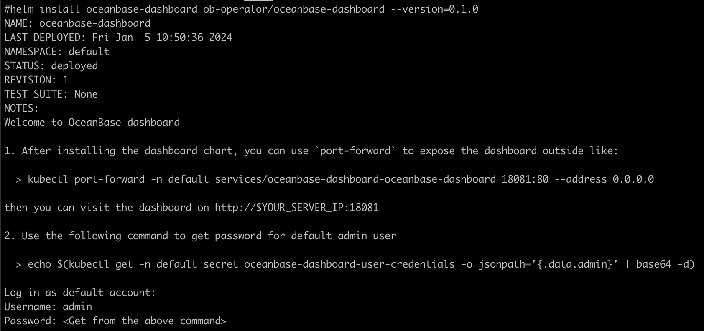
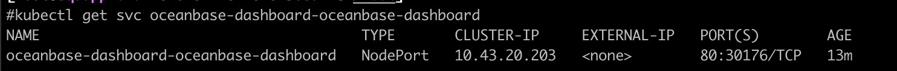
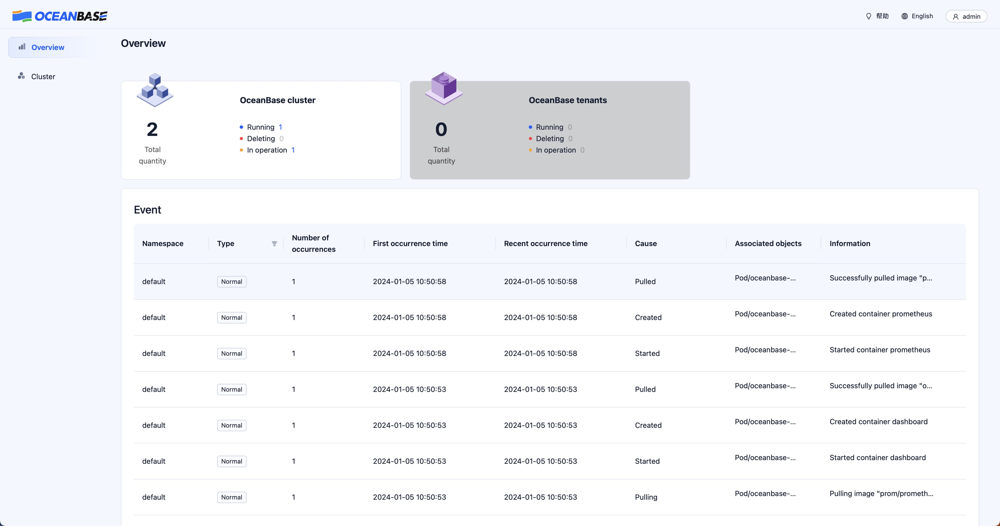
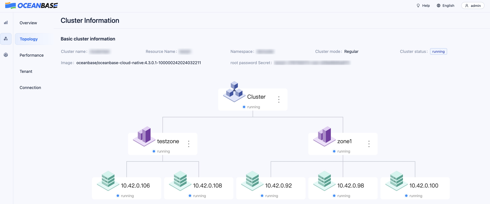
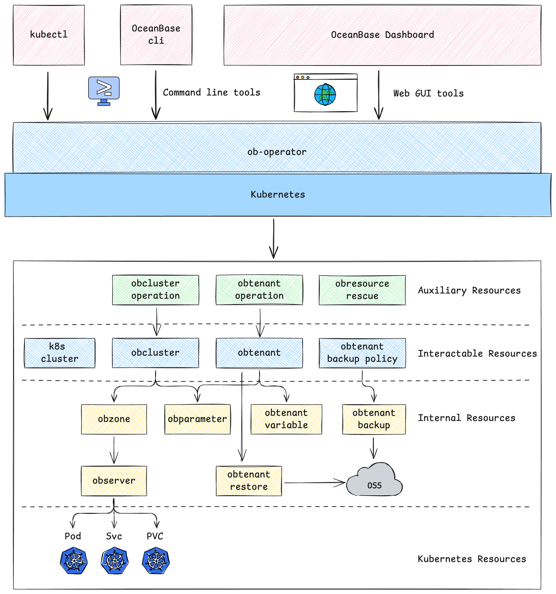

# ob-operator

`ob-operator` is a Kubernetes operator that simplifies the deployment and management of OceanBase cluster and related resources on Kubernetes.

此文档也提供[中文版](./README-CN.md)。

## Quick Start

This section provides a step-by-step guide on how to use ob-operator to deploy an OceanBase cluster.

### Prerequisites

Before getting started, please ensure you have a functional Kubernetes cluster with at least 2 CPU cores, 10GB of memory, and 100GB of storage space available.

ob-operator relies on [cert-manager](https://cert-manager.io/docs/) for certificate management. For instructions on installing cert-manager, please refer to the corresponding [installation](https://cert-manager.io/docs/installation/) documentation.
If you have trouble accessing `quay.io` image registry, our mirrored cert-manager manifests can be applied through following command:

```shell
kubectl apply -f https://raw.githubusercontent.com/oceanbase/ob-operator/2.2.1_release/deploy/cert-manager.yaml
```

Storage of OceanBase cluster in this example relies on [local-path-provisioner](https://github.com/rancher/local-path-provisioner), which should be installed beforehand. You should confirm that there is enough disk space in storage destination of local-path-provisioner. If you decide to deploy OceanBase cluster in production environment, it is recommended to use other storage solutions. We have provided a compatible table for storage solutions that we tested in section [Storage Compatibility](#storage-compatibility).

### Deploy ob-operator

#### Using YAML configuration file

You can deploy ob-operator in a Kubernetes cluster by executing the following command:

- Stable

```shell
kubectl apply -f https://raw.githubusercontent.com/oceanbase/ob-operator/2.2.1_release/deploy/operator.yaml
```

- Development

```shell
kubectl apply -f https://raw.githubusercontent.com/oceanbase/ob-operator/master/deploy/operator.yaml
```

#### Using Helm chart

Helm Chart parameterizes the namespace in which ob-operator is deployed, allowing you to specify the namespace before installing ob-operator.

```shell
helm repo add ob-operator https://oceanbase.github.io/ob-operator/
helm repo update
helm install ob-operator ob-operator/ob-operator --namespace=oceanbase-system --create-namespace --version=2.2.0
```

#### Using terraform

The required configuration files are conveniently located within the `deploy/terraform` directory of our repository.

1. Generate Configuration Variables:
   To begin, you'll need to generate a `terraform.tfvars` file, which will hold the configuration specifics of your Kubernetes cluster. Use the following commands to create this file.

```shell
cd deploy/terraform
./generate_k8s_cluster_tfvars.sh
```

2. Initialize Terraform:
   This step will ensure that Terraform has all the necessary plugins and modules to manage the resources. Use the following command to initialize the terraform environment.

```
terraform init
```

3. Apply Configuration:
   The final step is to deploy ob-operator. Execute the following command and Terraform will begin the deployment process

```
terraform apply
```

#### Verify deployment

After deployment/installation is complete, you can use the following command to verify if ob-operator is deployed successfully:

```shell
kubectl get pod -n oceanbase-system

# desired output
NAME                                            READY   STATUS    RESTARTS   AGE
oceanbase-controller-manager-86cfc8f7bf-4hfnj   2/2     Running   0          1m
```

### Deploy OceanBase Cluster

Before creating an OceanBase cluster, you need to create necessary secret to store specific user's password for OceanBase.

```shell
kubectl create secret generic root-password --from-literal=password='root_password'
```

You can deploy OceanBase in a Kubernetes cluster by executing the following command:

```shell
kubectl apply -f https://raw.githubusercontent.com/oceanbase/ob-operator/2.2.1_release/example/quickstart/obcluster.yaml
```

It generally takes around 2 minutes to bootstrap a cluster. Execute the following command to check the status of the cluster. Once the cluster status changes to "running," it indicates that the cluster has been successfully created and bootstrapped:

```shell
kubectl get obclusters.oceanbase.oceanbase.com test

# desired output
NAME   STATUS    AGE
test   running   6m2s
```

### Connecting to the OceanBase Cluster

Use the following command to find the POD IP of the observer. The naming convention for PODs is `${cluster_name}-${cluster_id}-${zone}-uuid`:

```shell
kubectl get pods -o wide
```

To connect, use the following command:

```shell
mysql -h{POD_IP} -P2881 -uroot -proot_password oceanbase -A -c
```

### OceanBase Dashboard

We are excited to unveil our innovative OceanBase Kubernetes Dashboard, a pioneering tool designed to enhance your experience with managing and monitoring OceanBase clusters on Kubernetes. We are proud to offer this amazing tool to our users and will actively work on new features and enhancements for future updates.

Deploy OceanBase Dashboard is pretty simple, just run the following commands

```
helm repo add ob-operator https://oceanbase.github.io/ob-operator/
helm repo update ob-operator
helm install oceanbase-dashboard ob-operator/oceanbase-dashboard
```



After OceanBase Dashboard is successfully installed, a default user admin is created with a random password, you can check the password using the command printed after installation.

```
echo $(kubectl get -n default secret oceanbase-dashboard-user-credentials -o jsonpath='{.data.admin}' | base64 -d)
```

A service of type NodePort is created by default, you can check the address and port and open it in browser

```
kubectl get svc oceanbase-dashboard-oceanbase-dashboard
```



Login with admin user and password



## Project Architecture

ob-operator is built on top of kubebuilder and provides control and management of OceanBase clusters and related applications through a unified resource manager interface, a global task manager instance, and a task flow mechanism for handling long-running tasks. The architecture diagram is approximately as follows:



For more detailed information about the architecture, please refer to the [Architecture Document](https://oceanbase.github.io/ob-operator/docs/developer/arch).

## Features

It provides various functionalities for managing OceanBase clusters, tenants, backup and recovery, and fault recovery. Specifically, ob-operator supports the following features:

- [x] Cluster Management: Bootstrap the cluster, adjust cluster topology, support K8s topology configuration, scale-in/out, cluster upgrade, modify parameters.
- [x] Tenant Management: Create tenants, adjust tenant topology, manage resource units, modify user passwords.
- [x] Backup and Recovery: Periodically backup data to OSS or NFS destinations, restore data from OSS or NFS.
- [x] Physical Standby: Restore standby tenant from backup, create empty standby tenant, activate standby tenant to primary, primary-standby switchover.
- [x] Fault Recovery: Single node fault recovery, cluster-wide fault recovery with IP preservation.
- [x] Dashboard(GUI): A web-based graphical management tool for OceanBase clusters based on ob-operator.

## Storage Compatibility

We have tested ob-operator with the following storage solutions:

| Storage Solution       | Tested Version | Compatibility | Notes                                        |
| ---------------------- | -------------- | ------------- | -------------------------------------------- |
| local-path-provisioner | 0.0.23         | ✅            | Recommended for development and testing      |
| Rook CephFS            | v1.6.7         | ❌            | CephFS does not support `fallocate` sys call |
| Rook RBD (Block)       | v1.6.7         | ✅            |                                              |
| OpenEBS (cStor)        | v3.6.0         | ✅            |                                              |
| GlusterFS              | v1.2.0         | ❓            | Requires kernel version >= 5.14              |
| Longhorn               | v1.6.0         | ✅            |                                              |
| JuiceFS                | v1.1.2         | ✅            |                                              |
| NFS                    | v5.5.0         | ❌            | Bootstrap with NFS protocol >= 4.2, but can not recycle tenant resource. |

## Supported OceanBase Versions

ob-operator supports OceanBase v4.x versions. Some features may require a specific OceanBase version. Please consult the documentation for details.

OceanBase v3.x versions are currently not supported by ob-operator.

## Development requirements

ob-operator is built using the [kubebuilder](https://book.kubebuilder.io/introduction) project, so the development and runtime environment are similar to it.

- To build ob-operator: Go version 1.20 or higher is required.
- To run ob-operator: Kubernetes cluster and kubectl version 1.18 or higher are required. We examined the functionalities on k8s cluster of version from 1.23 ~ 1.28 and ob-operator performs well.
- If using Docker as the container runtime for the cluster, Docker version 17.03 or higher is required. We tested building and running ob-operator with Docker 18.

## Documents

- [Architecture](https://oceanbase.github.io/ob-operator/docs/developer/arch)
- [Contributor Guidance](https://oceanbase.github.io/ob-operator/docs/developer/contributor-guidance)
- [User Manual](https://oceanbase.github.io/ob-operator/docs/manual/what-is-ob-operator)

## Getting Help

If you encounter any issues while using ob-operator, please feel free to seek help through the following channels:

- [GitHub Issue](https://github.com/oceanbase/ob-operator/issues)
- [Official Forum](https://ask.oceanbase.com/) (in Chinese)
- [Slack](https://oceanbase.slack.com/archives/C053PT371S7)
- WeChat Group (Add the assistant with WeChat ID: OBCE666)
- [DingTalk Group](https://h5.dingtalk.com/ecologicalOrg/index.html?code=v1,k1,8FudApZjHxgVTScBrgtz2mBfmEvOuiPm5J5dTS5tos4=&origin=11#/inviteOutsideJoin)


## Contributing

- [Submit an issue](https://github.com/oceanbase/ob-operator/issues)
- [Create a Pull request](https://github.com/oceanbase/ob-operator/pulls)

## License

ob-operator is licensed under the [MulanPSL - 2.0](http://license.coscl.org.cn/MulanPSL2) License.
You are free to copy and use the source code. When you modify or distribute the source code, please comply with the MulanPSL - 2.0 Agreement.
