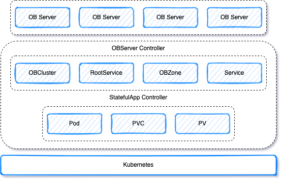

# ob-operator

ob-operator 可以让 OceanBase 以容器的方式，无缝运行在公有云或私有部署的 Kubernetes 集群上。

ob-operator 现已支持 OceanBase 集群的创建、删除，完整的节点生命周期管理，并通过 Service 的形式暴露给用户使用。后续会支持租户管理、ob-proxy 管理、多 Kubernetes 集群等功能。

目前支持通过 YAML、Kustomize 来部署 ob-operator。后续会支持 Helm 形式部署。



## 环境依赖

构建 ob-operator 需要 Go 1.16 版本及以上。

运行 ob-operator 需要 Kubernetes 1.16 版本及以上。
尚未支持多 Kubernetes 版本，后续会支持。

## 支持的 OceanBase 版本

后续会不断支持新的 OceanBase 社区版本。
暂不支持 3.1.2 之前的旧的 OceanBase 版本。目前仅对 OceanBase 社区版 3.1.2 进行了测试。

## 开始体验

### 使用 YAML 部署 ob-operator

1. 部署 CRD 相关文件。

```yaml
kubectl apply -f ./deploy/crd.yaml
```

2. 部署 ob-operator 相关文件。

注意配置 `--cluster-name` 启动参数，推荐与 Kubernetes 集群名称保持一致。

```yaml
kubectl apply -f ./deploy/operator.yaml
```

3. 配置节点 label。

需要将 Kubernetes 节点打 label，label 需要与 obcluster.yaml 中 `nodeSelector` 配置相匹配。
ob-operator 会将 Pod 调度到具有相应 label 的节点上。

推荐配置 label 的 key 为 `topology.kubernetes.io/zone`。

```yaml
kubectl label node nodename topology.kubernetes.io/zone=zonename
```

4. 部署 OceanBase 集群。

```yaml
kubectl apply -f ./deploy/obcluster.yaml
```

5. 集群部署成功后可以使用 Service 的 ClusterIP 连接 OceanBase 集群。

## 文档

参考 [ob-operator 文档](docs/hello-cn.md)。

## 获取帮助

如果您在使用 ob-operator 时遇到任何问题，欢迎通过以下方式寻求帮助：

- [GitHub Issue](https://github.com/oceanbase/ob-operator/issues)
- [官方网站](https://open.oceanbase.com/)

## 许可证

ob-operator 使用 [MulanPSL - 2.0](http://license.coscl.org.cn/MulanPSL2) 许可证。
您可以免费复制及使用源代码。当您修改或分发源代码时，请遵守木兰协议。
