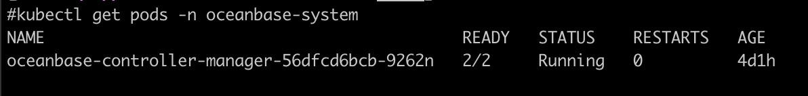

# Developing ob-operator

## environment-setup
1. go
ob-operator requires [go 1.20 or above](https://go.dev/doc/install) to build, you can refer to the official document to setup go environment.

2. make
ob-operator uses [make](https://www.gnu.org/software/make/) for a variety of build and test actions, it's need to be installed before you go.

3. kubebuilder
ob-operator uses kubebuilder as operator framework, before you dive into the code, it's highly recommended to read [kubebuilder books](https://book.kubebuilder.io).

## build ob-operator

1. build docker image
use the following command to build docker image
```
make docker-build
```

2. push docker image to repository
use the following command to push docker image
```
make docker-push
```

## deploy

1. install crd to K8s cluster
use the following command to generate crd and install to K8s cluster
```
make install
```
if you wish to save the crd as yaml format config file, you can run the following command
```
make export-crd
```
the generated file will be placed under deploy directory and named crd.yaml

2. deploy controller-manager to K8s cluster
use the following command to generate controller-manager config and deploy to K8s cluster
```
make deploy
```
if you wish to save the controller-manager deployment config as yaml format config file, you can run the following command
```
make export-operator
```
the generated file will be placed under deploy directory and named operator.yaml

After the above steps, CRDs and controller-manager are deployed to K8s cluster, to check the deployments are successful, you can check with the following command
```
# check crds
kubectl get crds

# check controller-manager
kubectl get pods -n oceanbase-system
```
you will get something like the following



## check logs
After deploying the crds and controller-manager, ob-operator will handle OceanBase related objects lifecycle management, you may test your own business by create a cr and make some modifications, ob-operator will handle the certain event. To test everything works properly, you can use the following command to check log message.
```
kubectl logs oceanbase-controller-manager-xxx -c manager -n oceanbase-system
```

`oceanbase-controller-manager-xxx` should be replaced by the real pod name

