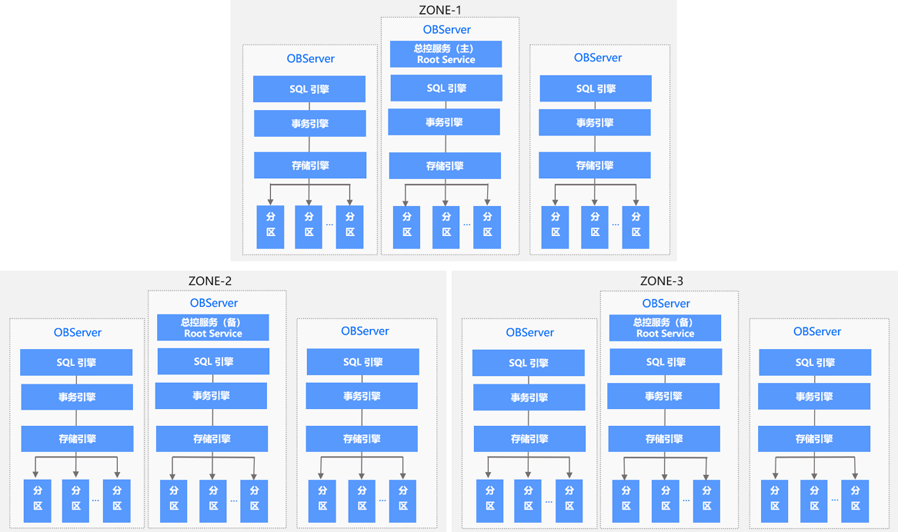
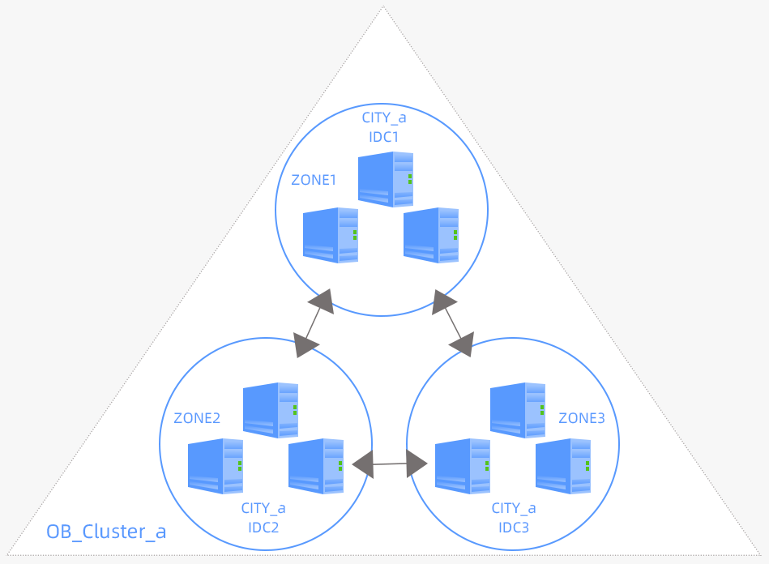
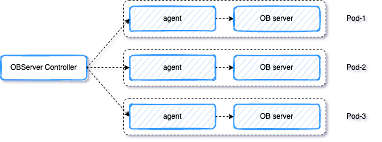
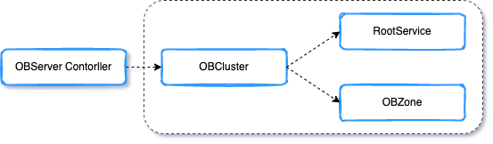

# 架构设计

ob-operator 与其他 operator 一样，旨在让 OceanBase 以容器的方式，无缝运行在 Kubernetes 集群上。

现阶段的 ob-operator 是一个孵化版，即为一个具备基础功能的框架，后续还需不断的迭代与完善。

ob-operator 现已支持 OceanBase 集群的创建、删除，完整的节点生命周期管理，并通过 Service 的形式暴露给用户使用。
后续会支持租户管理、ob-proxy 管理、多 Kubernetes 集群等功能。

目前支持通过 YAML、Kustomize 来部署 ob-operator。
后续会支持 Helm 形式部署。

## 基础概念



OceanBase 具有很好的高可用能力。

OceanBase 集群由多个 Zone 和多台 OBServer 构成。
OceanBase 集群的唯一标识是集群名称和集群 ID。



一个 OceanBase 集群，由若干个 Zone 组成。
Zone 是可用区（Availability Zone）的简写。

Zone 本身是一个逻辑概念，一般是同一机房的一组机器的组合。
物理层面来讲一个 Zone 通常等价于一个机房、一个数据中心或一个 IDC。
为保障更高级别的数据安全性和服务可用性， 一个 OceanBase 集群通常会分布在同城的 3 个机房中，同一份数据的三个副本分别分布在 3 个机房中（即三个 Zone 中）。

OceanBase 数据库支持数据跨地域（Region）部署，且不同 Region 的距离通常较远，从而满足地域级容灾的需求。一个 Region 可以包含一个或者多个 Zone。

Kubernetes 场景下需要对不同的节点打 label，以标识不同的 Zone 和 Region。

现阶段 ob-operator 已支持多 Zone 部署，尚不支持多 Region 部署。

## 分层架构


整个项目分三块：StatefulApp Controller、OBServer Controller 和 Operator Orchestrator。

StatefulApp Controller 负责 Pod、PVC、PV 的维护。
OBServer Controller 负责 OBServer 的维护。
Operator Orchestrator 负责在多个 Kubernetes 之间管理 ob-operator（该模块尚未实现）。

由于 OBServer 的注册信息与通信地址以 IP 为主，所以 Kubernetes 资源层基于 Simple Pod 封装自定义 CRD 实现。

StatefulApp Controller 是一个类似 StatefulSet 的管控工具，但与 StatefulSet 略有区别：

- StatefulApp 为每个 Pod 维护了一个有粘性的 ID。
- 每个 Pod 有自己独立的存储，相互不共享。
- StatefulApp 支持 Pod 间配置异构。
- StatefulApp 的部署、更新是有序的，同 StatefulSet 一样。
- StatefulApp 支持对指定 Pod 做操作。
- StatefulApp 不支持基于 serviceName 的通信。



每个 Pod 会映射为一个 OBServer。

目前一个 Pod 中只包含一个 OBServer 容器，后续会以 Sidecar 的形式支持日志与监控容器。

OBServer 容器中会有一个很轻量的 Agent，负责与 OBServer Controller 交互、执行运维操作、维护 OBServer 进程。



OB Operator 会创建三种 CRD：OBCluster、OBRootService 和 OBServer。OBZone、OBRootService 为 OBCluster 的子资源。

OBCluster：
对 OceanBase 集群的定义，以整体的状态管理，全局视角，不涉及细节。用户需要自己定义 OBCluster 的配置。

```yaml
apiVersion: cloud.oceanbase.com/v1
kind: OBCluster
metadata:
  namespace: oceanbase
  name: ob-test
spec:
  version: 3.1.1-4
  clusterID: 1
  topology:
    - cluster: cn
      zone:
      - name: zone1
        region: region1
        nodeSelector:
          topology.kubernetes.io/zone: zone1
        replicas: 1
      - name: zone2
        region: region1
        nodeSelector:
          topology.kubernetes.io/zone: zone2
        replicas: 1
      - name: zone3
        region: region1
        nodeSelector:
          topology.kubernetes.io/zone: zone3
        replicas: 1
  resources:
    cpu: 2
    memory: 10Gi
    storage:
      - name: data-file
        storageClassName: "local-path"
        size: 50Gi
      - name: data-log
        storageClassName: "local-path"
        size: 50Gi
      - name: log
        storageClassName: "local-path"
        size: 30Gi
status:
  status: Ready
  topology:
    - cluster: cn
      clusterStatus: Ready
      lastTransitionTime: "2021-12-01T07:07:55Z"
      zone:
      - name: zone1
        region: region1
        zoneStatus: Ready
        expectedReplicas: 1
        availableReplicas: 1
      - name: zone2
        region: region1
        zoneStatus: Ready
        expectedReplicas: 1
        availableReplicas: 1
      - name: zone3
        region: region1
        zoneStatus: Ready
        expectedReplicas: 1
        availableReplicas: 1
```

OBZone：
Zone 维度 OBServer 的状态。用户可以通过 OBZone 来查看 OceanBase 集群中 OBServer 的状态。用户不需要创建，ob-operator 会自动维护并定期更新。

```yaml
apiVersion: cloud.oceanbase.com/v1
kind: OBZone
metadata:
  namespace: oceanbase
  name: obzone-ob-test
  labels:
    app: ob-test
spec:
  topology:
  - cluster: cn
    zone:
    - name: zone1
      nodeSelector:
        topology.kubernetes.io/zone: zone1
      region: region1
      replicas: 1
    - name: zone2
      nodeSelector:
        topology.kubernetes.io/zone: zone2
      region: region1
      replicas: 1
    - name: zone3
      nodeSelector:
        topology.kubernetes.io/zone: zone3
      region: region1
      replicas: 1
status:
  topology:
  - cluster: cn
    zone:
    - name: zone1
      nodes:
      - serverIP: 10.10.10.1
        status: active
    - name: zone2
      nodes:
      - serverIP: 10.10.10.2
        status: active
    - name: zone3
      nodes:
      - serverIP: 10.10.10.3
        status: active
```

RootService：
集群维度 RootService 的分布情况、单个 RootService 的健康状态。用户可以通过 RootService 来查看 OceanBase 集群中 RootService 的状态。用户不需要创建，ob-operator 会自动维护并定期更新。

```yaml
apiVersion: cloud.oceanbase.com/v1
kind: RootService
metadata:
  namespace: oceanbase
  name: rs-ob-test
  labels:
    app: ob-test
spec:
  topology:
  - cluster: cn
    zone:
    - name: zone1
      nodeSelector:
        topology.kubernetes.io/zone: zone1
      region: region1
      replicas: 1
    - name: zone2
      nodeSelector:
        topology.kubernetes.io/zone: zone2
      region: region1
      replicas: 1
    - name: zone3
      nodeSelector:
        topology.kubernetes.io/zone: zone3
      region: region1
      replicas: 1
status:
  topology:
  - cluster: cn
    zone:
    - name: zone1
      role: 1
      serverIP: 10.10.10.1
      status: active
    - name: zone2
      role: 2
      serverIP: 10.10.10.2
      status: active
    - name: zone3
      role: 2
      serverIP: 10.10.10.3
      status: active
```
