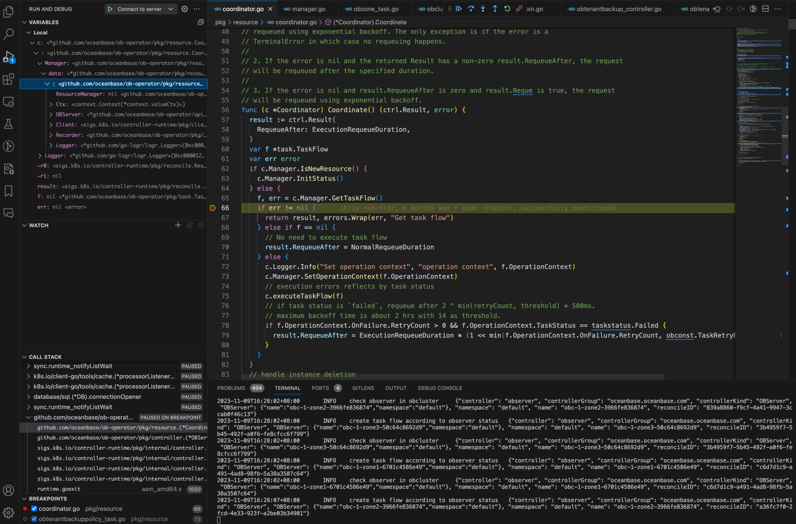

# Develop ob-operator locally

Tips: In this tutorial, we'll disable webhook validation and run manager controller on our laptop. The controller manager will communicate with kubernetes cluster by local .kube/config configuration file.

## Background

ob-operator depends on [kubebuilder](https://kubebuilder.io/introduction), an operator framework maintained by kubernetes SIGS. It offers convenient utilities to bootstrap an operator and manage API types in it. Like other operator frameworks, kubebuilder depends on kubernetes [controller runtime](https://github.com/kubernetes-sigs/controller-runtime) either, which is an excellent reference to know how kubernetes dispatch events and reconcile resources.

## Disable Webhook and CertManager

There are many configuration items that marked by `[CERTMANAGER]` and `[WEBHOOK]` in the two files `config/crd/kustomization.yaml` and `config/default/kustomization.yaml`. They are used to enable and configure webhooks in real kubernetes deployment. Because we want to run controller manager locally, we need to disable them.

You could just apply the latest `deploy/operator.yaml` manifest and delete the following resources to deploy CRDs and make controller manager uninstalled. 

```shell
kubectl delete validatingwebhookconfigurations.admissionregistration.k8s.io oceanbase-validating-webhook-configuration
kubectl delete mutatingwebhookconfigurations.admissionregistration.k8s.io oceanbase-mutating-webhook-configuration
kubectl delete -n oceanbase-system svc oceanbase-webhook-service
kubectl delete -n oceanbase-system deployments.apps oceanbase-controller-manager
```

## Self-signed Certificate

It's necessary for node hosting controller manager to have a TLS certificate. In the real kubernetes cluster, the cert-manager will inject the sign into the controller manager pod. On our laptop, we need self-sign one:

```shell
mkdir -p /tmp/k8s-webhook-server/serving-certs
openssl genrsa -out /tmp/k8s-webhook-server/serving-certs/tls.key 2048
openssl req -new -key /tmp/k8s-webhook-server/serving-certs/tls.key -out /tmp/k8s-webhook-server/serving-certs/tls.csr
openssl x509 -req -days 365 -in /tmp/k8s-webhook-server/serving-certs/tls.csr -signkey /tmp/k8s-webhook-server/serving-certs/tls.key -out /tmp/k8s-webhook-server/serving-certs/tls.crt
```

## Run locally

There are some useful commands in `Makefile` and `make/*.mk`, we could type `make run-local` to start controller manager locally. Or redirect the output to a log file for better analytic experience, 

```shell
# print log to stdout
make run-local
# or redirect output to a file
make run-local &> bin/run.log
```

## Debug locally

Though print debugging is enough for most cases, there are quite some cases that are not obvious from printed information. We could debug with go debugging tool [delve](https://github.com/go-delve/delve).

`install-delve` command is declared in `make/debug.mk`, we can type `make install-delve` to get it. The help message of it can be glanced, 

```shell dlv help
Delve is a source level debugger for Go programs.

Delve enables you to interact with your program by controlling the execution of the process,
evaluating variables, and providing information of thread / goroutine state, CPU register state and more.

The goal of this tool is to provide a simple yet powerful interface for debugging Go programs.

Pass flags to the program you are debugging using `--`, for example:

`dlv exec ./hello -- server --config conf/config.toml`

Usage:
  dlv [command]

Available Commands:
  attach      Attach to running process and begin debugging.
  completion  Generate the autocompletion script for the specified shell
  connect     Connect to a headless debug server with a terminal client.
  core        Examine a core dump.
  dap         Starts a headless TCP server communicating via Debug Adaptor Protocol (DAP).
  debug       Compile and begin debugging main package in current directory, or the package specified.
  exec        Execute a precompiled binary, and begin a debug session.
  help        Help about any command
  test        Compile test binary and begin debugging program.
  trace       Compile and begin tracing program.
  version     Prints version.

Additional help topics:
  dlv backend    Help about the --backend flag.
  dlv log        Help about logging flags.
  dlv redirect   Help about file redirection.
```

## Start debugging

Run `make run-delve` to start debugging server.

### Debug in terminal

If you prefer to debug in terminal, with `dlv connect 127.0.0.1:2345` command you can connect to the debugging server. After connecting, you enter a REPL environment of delve, available commands are showed below, 

```shell
(dlv) help
The following commands are available:

Running the program:
    call ------------------------ Resumes process, injecting a function call (EXPERIMENTAL!!!)
    continue (alias: c) --------- Run until breakpoint or program termination.
    next (alias: n) ------------- Step over to next source line.
    rebuild --------------------- Rebuild the target executable and restarts it. It does not work if the executable was not built by delve.
    restart (alias: r) ---------- Restart process.
    step (alias: s) ------------- Single step through program.
    step-instruction (alias: si)  Single step a single cpu instruction.
    stepout (alias: so) --------- Step out of the current function.

Manipulating breakpoints:
    break (alias: b) ------- Sets a breakpoint.
    breakpoints (alias: bp)  Print out info for active breakpoints.
    clear ------------------ Deletes breakpoint.
    clearall --------------- Deletes multiple breakpoints.
    condition (alias: cond)  Set breakpoint condition.
    on --------------------- Executes a command when a breakpoint is hit.
    toggle ----------------- Toggles on or off a breakpoint.
    trace (alias: t) ------- Set tracepoint.
    watch ------------------ Set watchpoint.

Viewing program variables and memory:
    args ----------------- Print function arguments.
    display -------------- Print value of an expression every time the program stops.
    examinemem (alias: x)  Examine raw memory at the given address.
    locals --------------- Print local variables.
    print (alias: p) ----- Evaluate an expression.
    regs ----------------- Print contents of CPU registers.
    set ------------------ Changes the value of a variable.
    vars ----------------- Print package variables.
    whatis --------------- Prints type of an expression.

Listing and switching between threads and goroutines:
    goroutine (alias: gr) -- Shows or changes current goroutine
    goroutines (alias: grs)  List program goroutines.
    thread (alias: tr) ----- Switch to the specified thread.
    threads ---------------- Print out info for every traced thread.

Viewing the call stack and selecting frames:
    deferred --------- Executes command in the context of a deferred call.
    down ------------- Move the current frame down.
    frame ------------ Set the current frame, or execute command on a different frame.
    stack (alias: bt)  Print stack trace.
    up --------------- Move the current frame up.

Other commands:
    config --------------------- Changes configuration parameters.
    disassemble (alias: disass)  Disassembler.
    dump ----------------------- Creates a core dump from the current process state
    edit (alias: ed) ----------- Open where you are in $DELVE_EDITOR or $EDITOR
    exit (alias: quit | q) ----- Exit the debugger.
    funcs ---------------------- Print list of functions.
    help (alias: h) ------------ Prints the help message.
    libraries ------------------ List loaded dynamic libraries
    list (alias: ls | l) ------- Show source code.
    packages ------------------- Print list of packages.
    source --------------------- Executes a file containing a list of delve commands
    sources -------------------- Print list of source files.
    target --------------------- Manages child process debugging.
    transcript ----------------- Appends command output to a file.
    types ---------------------- Print list of types

Type help followed by a command for full documentation.
```

### In VSCode

If you are first to debugging in VSCode, enter `Cmd+Shift+P` to open commands panel. Then, type `Debug: Add Configuration...` and create debugging task for Go. After creating task successfully, open commands panel and type `Debug: Start Debugging`/`Debug: Select and Start Debugging` to start debugging.

